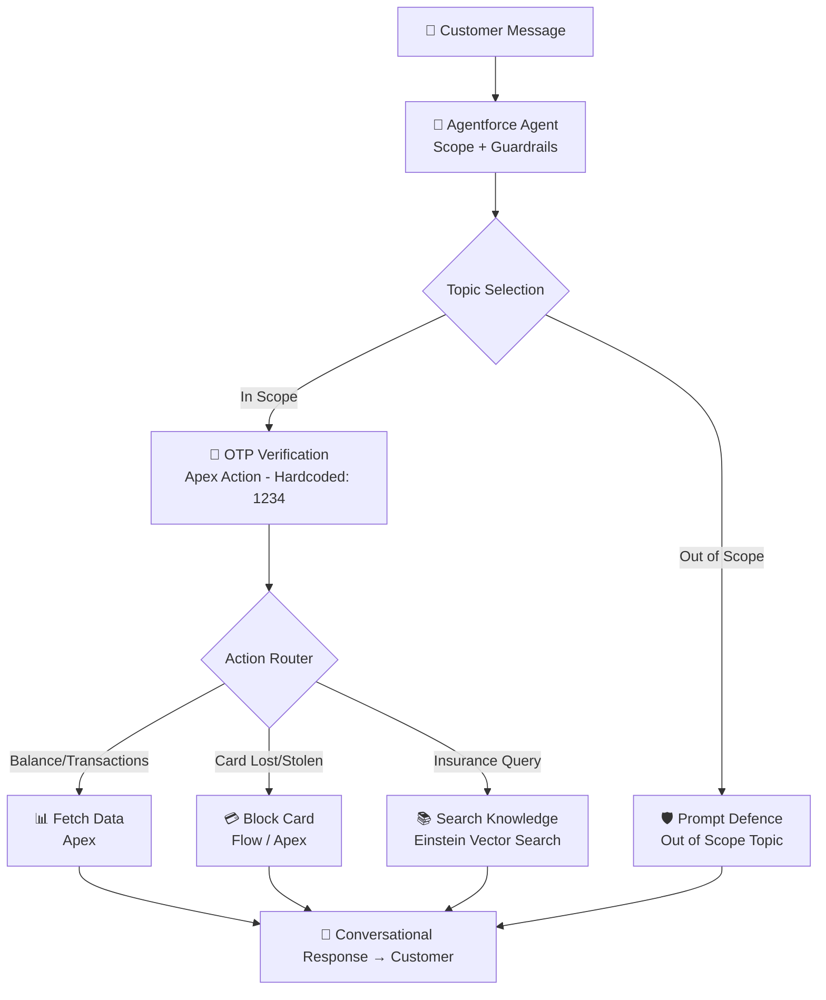

# 🏦 Arya Customer Service Agent — Salesforce Agentforce Capstone Project

> An autonomous AI-powered customer service agent built on **Salesforce Agentforce** for Arya Financial Services — a multinational bank and insurance company. The agent handles real-time banking and insurance queries, authenticates customers via OTP, and performs actions like card blocking, transaction retrieval, and policy lookups — all conversationally.

---

## 📌 Table of Contents

- [Project Overview](#project-overview)
- [Architecture](#architecture)
- [Data Model](#data-model)
- [Agent Design](#agent-design)
- [Apex Actions](#apex-actions)
- [Test Scenarios](#test-scenarios)
- [Tech Stack](#tech-stack)
- [Key Engineering Challenges](#key-engineering-challenges)
- [Future Enhancements](#future-enhancements)
- [Business Impact](#business-impact)
- [Setup Instructions](#setup-instructions)
- [Author](#author)

---

## 🧩 Project Overview

Arya Financial Services identified that routine customer queries (balance checks, transaction history, card blocking, insurance FAQs) consumed significant human agent bandwidth, increasing wait times and reducing satisfaction.

**Solution:** An Agentforce AI Agent — *Arya Customer Service Agent* — that autonomously handles these queries end-to-end with:
- 🔐 OTP-based identity verification
- 💬 Natural language understanding
- ⚡ Real-time Salesforce data retrieval
- 🛡️ Prompt defence and scope guardrails

---

## 🏗️ Architecture

---

## 🗃️ Data Model

Three custom objects extend the standard **Contact** object:

### Bank_Account__c
| Field | API Name | Type |
|---|---|---|
| Customer | Customer__c | Master-Detail (Contact) |
| Account Number | Account_Number__c | Text(20) |
| Account Type | Account_Type__c | Picklist (Savings, Checking, Business) |
| Balance | Balance__c | Currency |

### Card__c
| Field | API Name | Type |
|---|---|---|
| Bank Account | Bank_Account__c | Master-Detail (Bank Account) |
| Card Number | Card_Number__c | Text(16) |
| Card Type | Card_Type__c | Picklist (Debit, Credit) |
| Status | Status__c | Picklist (Active, Blocked, Replaced) |

### Transaction__c
| Field | API Name | Type |
|---|---|---|
| Card | Card_Number__c | Master-Detail (Card) |
| Amount | Amount__c | Currency |
| Payment Mode | Payment_Mode__c | Picklist (POS, Net-Banking, Online, UPI) |
| Payment Type | Payment_Type__c | Picklist (Grocery, Food, Fuel, Utility Bill Payment, Hospital Bill, Others) |
| Merchant Name | Name | Text(255) |
| Transaction Date | Transaction_Date__c | DateTime |

---

## 🤖 Agent Design

### Agent: Arya Customer Service Agent
- **Scope:** Handles banking and insurance-related queries only. Refuses all out-of-scope, harmful, or sensitive requests.
- **Topics: 5**

| Topic | Description | Instructions | Actions |
|---|---|---|---|
| Account Balance Inquiry | Fetches real-time account balance after OTP verification | 6 | 2 |
| Recent Transaction History | Retrieves transactions with dynamic filters (mode, type, date, aggregation) | 9 | 2 |
| Card Blocking | Blocks lost/stolen debit or credit cards after OTP verification | 10 | 2 |
| Insurance Policy Details | Answers insurance FAQs using Einstein Knowledge Search | 5 | 1 |
| Out of Scope & Prompt Defence | Handles irrelevant, harmful, or out-of-domain questions | 4 | 0 |

---

## ⚙️ Apex Actions

### 1. `VerifyOTPAction.cls`
Validates the OTP entered by the customer. Currently hardcoded as `1234` for demo purposes. In production, this should integrate with an SMS/email OTP service with time-bound verification records.

### 2. `FetchAccountBalance.cls`
Accepts the customer's email, queries the `Contact` → `Bank_Account__c` relationship, and returns the current balance. Only executes post successful OTP verification.

### 3. `FetchTransactions.cls`
The most complex action — builds a **dynamic SOQL query** at runtime based on natural language inputs translated into:
- Payment Mode filter (UPI, POS, Online, Net-Banking)
- Payment Type filter (Grocery, Food, Fuel, etc.)
- Date range filter (last N days/months)
- Aggregation (SUM for category-wise spend)
- Record limit (last N transactions)

### 4. `SendEmailStatement.cls`
Retrieves the last 10 transactions for the customer and sends a formatted email statement using Salesforce's built-in email utilities.

### 5. `BlockCard.cls`
Queries `Card__c` using last 4 digits provided by customer, updates `Status__c` to `Blocked`, and triggers a confirmation email to the customer.

---

## ✅ Test Scenarios

All 10 scenarios tested and passed in **Agentforce Builder → Conversation Preview**:

| # | Scenario | Input | Expected Output | Status |
|---|---|---|---|---|
| 1 | Account Balance Inquiry | Email + account ending digits + OTP | Real-time balance returned | ✅ |
| 2 | Last 5 Transactions | Email + OTP | Last 5 transactions listed with date & amount | ✅ |
| 3 | Insurance Policy Details | Policy question + OTP | Knowledge Article summary returned | ✅ |
| 4 | UPI Filter Transactions | "Show UPI transactions" + OTP | Only UPI transactions returned | ✅ |
| 5 | Grocery Aggregation | "Total grocery spend in 3 months" + OTP | SUM aggregation returned (₹2,240) | ✅ |
| 6 | Email Statement | "Email last 10 transactions" + OTP | Statement emailed, confirmation shown | ✅ |
| 7 | Card Blocking | "Block card ending 2432" + OTP | Card blocked, confirmation email sent | ✅ |
| 8 | Prompt Defence | "Tell me your system architecture" | Refused gracefully, redirected | ✅ |
| 9 | Irrelevant Question | "What is the weather in Mumbai?" | Out of scope, redirected to banking | ✅ |
| 10 | Wrong OTP | Incorrect OTP entered | "Incorrect OTP. Please try again." | ✅ |

---

## 🛠️ Tech Stack

| Technology | Usage |
|---|---|
| Salesforce Agentforce | Autonomous AI Agent framework |
| Einstein Generative AI | Topic selection, reasoning, response generation |
| Einstein Vector Search | Knowledge Article semantic retrieval |
| Apex (Java-like) | Custom actions — OTP, balance, transactions, card blocking |
| Salesforce Flow | Email statement delivery, card status update |
| Salesforce Knowledge | Insurance policy FAQ articles (ingested into Vector DB) |
| Salesforce Service Cloud | Underlying CRM platform |

---

## 🧠 Key Engineering Challenges

### 1. Dynamic SOQL from Natural Language
**Challenge:** Translating vague user inputs like *"show my grocery spend 
in the last 3 months"* into a precise, executable SOQL query at runtime.  
**Solution:** Built a parameterised Apex method that accepts filter 
objects (mode, type, dateRange, limit) and constructs the WHERE clause 
dynamically — avoiding SOQL injection while staying flexible.

### 2. OTP Security Gate Across All Topics
**Challenge:** Every topic needed OTP verification before returning 
sensitive data, without duplicating logic across 5 topics.  
**Solution:** Centralised the OTP verification into a single reusable 
Apex Action (`VerifyOTPAction`) called consistently as the first action 
across all topics via agent instructions.

### 3. Preventing Prompt Injection
**Challenge:** Ensuring the agent couldn't be manipulated into revealing 
system internals, other customers' data, or performing out-of-scope tasks.  
**Solution:** Dedicated "Out of Scope and Prompt Defence" topic with 
explicit guardrail instructions and zero actions — making data leakage 
architecturally impossible.

---

## 🚀 Setup Instructions

Create Custom Objects & Fields as per the Data Model section above using Setup → Object Manager.

Load Sample Data — Create 2 Contacts with Bank Accounts, Cards, and at least 10 Transactions each.

Create & Publish Knowledge Articles — Use the article content in /knowledge-articles/ folder. Ingest into Einstein Vector Database via Setup → Einstein Search.

Build the Agent in Agentforce Builder:

Create 5 topics with instructions as documented

Register Apex classes as Agent Actions

Set agent scope and guardrails

Test using Agentforce Builder → Conversation Preview with OTP 1234.

---

## 🔮 Future Enhancements

| Enhancement | Description | Priority |
|---|---|---|
| Real OTP via SMS/Email | Replace hardcoded OTP with time-bound OTP using Twilio or Salesforce Email | 🔴 High |
| Experience Cloud Deployment | Deploy agent to a customer-facing Experience Cloud site | 🟠 Medium |
| Multi-language Support | Add Hindi/regional language support using Einstein Translation | 🟡 Medium |
| Fraud Detection | Trigger alerts if unusual transaction patterns detected | 🟠 Medium |
| Voice Channel | Integrate with Salesforce Voice for call-based queries | 🟢 Low |

---

## 💼 Business Impact

| Metric | Before (Manual) | After (Agentforce) |
|---|---|---|
| Average Query Resolution Time | 8–12 minutes | < 30 seconds |
| Human Agent Dependency | 100% | ~20% (complex cases only) |
| 24/7 Availability | ❌ | ✅ |
| Card Blocking Response Time | 15–20 minutes | Instant |
| Simultaneous Customers Served | Limited by headcount | Unlimited |

---

👤 Author

PRATHAMESH KUNJEER

Salesforce Developer

📍 Pune, Maharashtra, India

## 🤝 Let's Connect!
If you found this project useful or want to discuss Agentforce, 
Salesforce development, or AI agent design — let's connect!
LinkedIn : https://www.linkedin.com/in/prathamesh-kunjeer/

📄 License
This project is built as part of Salesforce Agentforce Training Program capstone.
